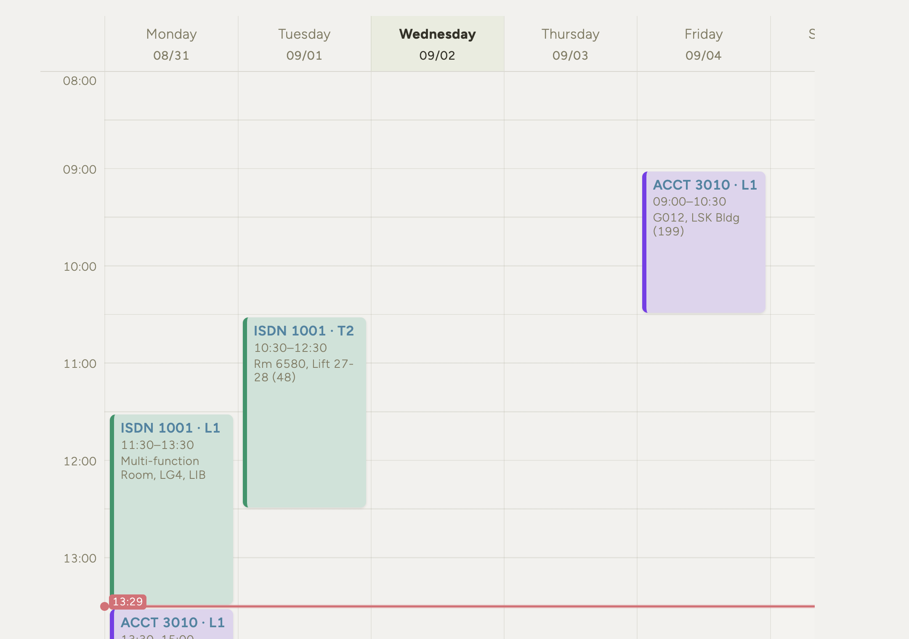
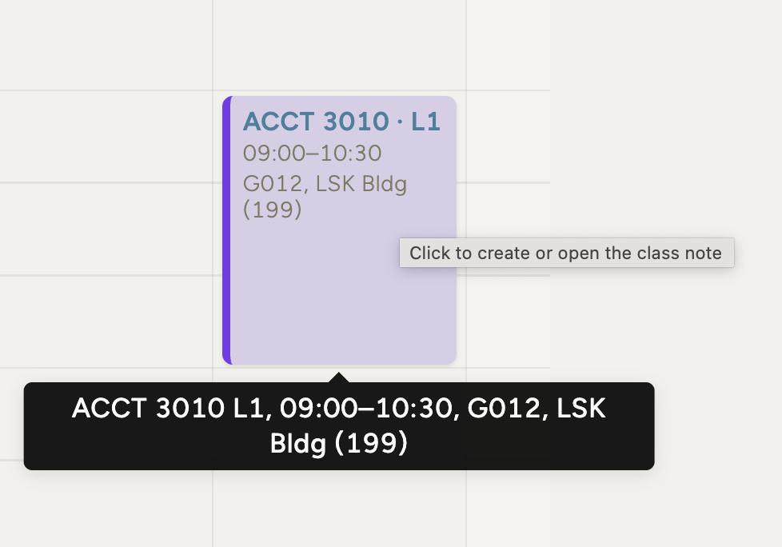

# Obsidian Timetable Generator

Generate an interactive weekly timetable for Obsidian from an iCalendar (`.ics`) file.

## 1. Export your timetable

Visit [HKUST Timetable Planner](https://admlu65.ust.hk/) and export your timetable as an `.ics` file.

## 2. Install Dataview

Install and enable the [Dataview plugin](https://community.obsidian.md/plugins/dataview) in Obsidian.

The Chart plugin is not required.

## 3. Generate the Markdown page

### macOS shortcut

1. Double-click `Generate Timetable.command`.
2. Drag your exported `.ics` file into the Terminal window.
3. Press Return.

The generated `Weekly Timetable.md` file will be saved in the same folder as `Generate Timetable.command` and revealed in Finder.

You can also drag the `.ics` file directly onto `Generate Timetable.command`.

### Command line

Place `generate_timetable.py` and your `.ics` file in the same folder, then run:

```bash
python3 generate_timetable.py timetable.ics -o "Weekly Timetable.md"
```

Optional timezone override:

```bash
python3 generate_timetable.py timetable.ics -o "Weekly Timetable.md" --timezone Asia/Hong_Kong
```

The script uses only Python's standard library and requires no extra packages.

## 4. Add the page to Obsidian

Move the generated `Weekly Timetable.md` file into your Obsidian vault and open it.

The page includes:

- A Monday–Sunday weekly timetable
- A live current-time line
- Clickable class blocks
- Automatic class-note creation grouped by course folder

## Examples




